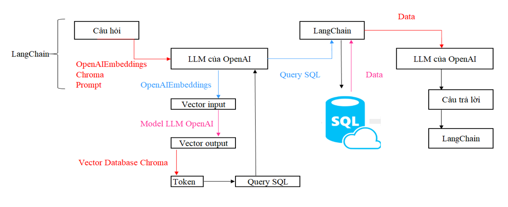

# RECOMMENDER_SYSTEM_API

## Overview
Xây dựng hệ thống gợi ý sản phẩm và chatbot bằng FastAPI

## Mục lục
1. [Chức năng](#Chức-năng)
2. [Công nghệ](#Công-nghệ)
3. [Yêu cầu](#Yêu-cầu)
4. [Cài đặt](#Cài-đặt)
5. [Sử dụng](#Sử-dụng)

## Chức năng
1. Gợi ý sản phẩm bằng thuật toán KNN dựa trên số sao đánh giá của người dùng cho sản phẩm
    - Sử dụng thư viện `surprise` để thực hiện các thao tác với dữ liệu
    - Tiền xử lý dữ liệu (sử dụng 2 bảng `REVIEW` và `PRODUCT`)
    - Kiểm tra độ tin cậy của model (`train data` và `test data` dựa trên thông số `RMSE` và `MAE`)
    - Chọn `k` phù hợp với tập dữ liệu (Cross Validation để tìm `k`)
2. Chatbot trả lời câu hỏi người dùng liên quan đến sản phẩm trong hệ thống
    
    - Sử dụng Langchain để build chatbot thông qua OpenAI LLM
    - Cấu hình LLM cho chatbot (GPT version), vector database và toolkit database
    - Viết các ngân hàng câu vào 1 prompt
    - Định hình cho chatbot (hướng dẫn trả lời dựa trên câu hỏi người dùng)

## Công nghệ
1. Framework: FastAPI
2. Ngôn ngữ: Python
3. Database: MySQL
4. Khác: Swagger, Langchain, Surprise

## Yêu cầu
1. Python > 3.10
2. MySQL 8+

## Cài đặt
1. Clone project
```bash
git clone https://github.com/Arkadian404/recommender_system_api.git
```
2. Mở project bằng IDE(VSCode, PyCharm, ...) hoặc cmd

3. Tạo môi trường ảo
```bash
python -m venv env
env\Scripts\activate
```
4. Cài đặt các thư viện cần thiết trong file `requirements.txt`
```bash\
pip install -r requirements.txt
```
5. Tạo database bằng file `dataSample.sql` (nếu chưa có)
6. Tạo file `.env`
```bash
OPENAI_API_KEY = "verysecretkey"
LANGCHAIN_TRACING_V2 = "true"
LANGCHAIN_API_KEY = "verysecretkey" 
```
7. Chạy project
```bash
uvicorn main:app --reload
```
hoặc run bằng IDE

## Sử dụng
1. Khi chạy project, port mặc định sẽ là 8000. Truy cập vào `http://127.0.0.1:8000/docs` để test qua các method của project trong Swagger
2. Ở file `.env` có 2 phần API key của OpenAI và LangSmith (có thể bỏ qua nếu chỉ test KNN)
3. Có thể tùy chỉnh host, port, database name trong `main.py` cho phù hợp


